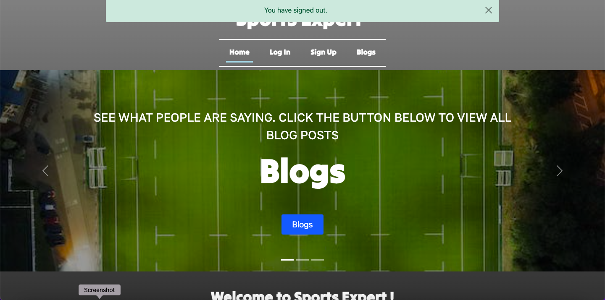
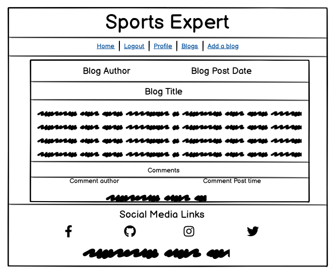

# **Sports Expert**

## **Overview**

Sports Expert is a sports blog website where users can make blog posts about a specific sport, view blog posts by other users and
comment on blog posts. They can also edit their profile and upload their own profile picture aswell as add information about themselves.

Developed by Sean Johnston for code institute Project Portfolio project 4.

Link to the live site : [Sports Expert](https://sports-blog.herokuapp.com/)

## **Contents**

1. [Overview](#overview)
2. [Project Goals](#project-goals)
3. [U/X](#ux)
   - [The Strategy Plane](#the-strategy-plane)
      - [Target Users](#target-users)
      - [Site Goals](#site-goals)
   - [The Scope Plane](#the-scope-plane) 
   - [Agile Planning](#agile-planning)  
      - [Epics](#epics)
      - [User Stories](#user-stories)
   - [The Structure Plane](#the-structure-plane)  
      - [Features](#features)  
         - [Home Page](#home-page)
         - [Blog Home Page](#blog-home-page)
         - [Blog Detail Page](#blog-detail-page)
         - [Profile Page](#profile-page)
         - [Add A Blog Page](#add-a-blog-page)
         - [User Authentication Pages](#user-authentication-pages)
         - [Custom Error Pages](#custom-error-pages)
      - [Future Features](#future-features)  
   - [The Skeleton Plane](#the-skeleton-plane)  
      - [Database Schema](#database-schema) 
      - [Wireframes](#wireframes)
   - [The Surface Plane](#the-surface-plane) 
      - [Design](#design)   
          - [Colour Scheme](#colour-scheme)
          - [Typography](#typography)
          - [Imagery](#imagery)
4. [Technologies Used](#technologies-used)  
    - [Languages used](#languages-used)
    - [Frameworks used](#frameworks-used)
    - [Other Technologies used](#other-technologies-used)
    - [Libraries Used](#libraries-used)
5. [Testing](#testing)
6. [Deployment](#deployment)    
    - [Heroku Deployment](#heroku-deployment)
    - [Forking The Repository](#forking-the-repository)
    - [Clone The Repository](#clone-the-repository)
7. [Credits](#credits)
    - [Project Set Up and Github Template](#project-set-up-and-github-template)
    - [Media And Content](#media-and-content)
    - [Code And Issues](#code-and-issues)
    - [Unit Testing](#unit-testing)
8. [Acknowledgements](#acknowledgements)    

## **Project Goals**

As my fourth project for the [Code Institute](https://codeinstitute.net/) 5P course, the goal of the project is to demonstrate all of the skills I have learned in the course so far including languages such as HTML, CSS, Javascript and Python. Frameworks such as Django and Bootstrap and version control technologies such as Git and Github.

[Top of page &uarr;](#contents)

## **U/X**

## **The Strategy Plane**

Sports Expert was designed to be a site for Sports lovers to share and read their own and other peoples opinions on multiple sports topics. The site was designed in a way that it is easy to navigate, and a homepage U.I that grabs new and returning users attention. Users can upload their own BlogPosts, comment on other users blogposts aswell as edit their own profile which is intended to create a proper website community.

### **Target Users**

- A user that is a sports fan
- A user that likes to keep up to date with sports news
- A user that wants to create their own blogpost on a sport topic
- A user that wants to join in with the community and comment on other peoples blogposts or start a discussion.

### **Site Goals**

- For users to be able to create an account, login and logout when they want.
- For users to be able to view blogposts regardless if they have made an account and are signed in or out
- For users to be able to create their own blogposts while logged in.
- For users to be able to comment on their own and other peoples blogposts while logged in
- For users to be able to edit their profile including adding thier own profile picture while logged in.

[Top of page &uarr;](#contents)

## **The Scope Plane**

 - CRUD Ability for authenticated users on Blogposts, Comments and User Profiles
 - Restricted site features for authenticated and non-authenticated users such as adding Blogposts and viewing profile pages.
 - Full responsiveness for all screen sizes including hamburger navigation menu for mobile screens and different blogpost card layout
 for different screen sizes.
 - Eye-catching carousel on top of the home page to catch new site users attention as soon as they enter the site.

## **Agile Planning**

This project was built using the Agile method throughout by creating EPIC Milestones which were broken down into smaller user stories with labels "must-have", "should-have", "could-have", and wont have. 

Epics milestones were given Acceptance criteria and the must haves were completed first to complete the milestone. Any user stories that were not completed were moved back into the project backlog.

The Kanban board was created using Github projects and can be located [here](https://github.com/users/seanj06/projects/5/views/1)  and can be viewed to see the completed and backlogged user stories.

[Top of page &uarr;](#contents)

### **Epics**

Epics were broken down into 9 EPIC Milestones(including backlog)
which includes 37 user stories in total. Each Milestone was given acceptance criteria and the milestone was closed when all the criteria had been met / all user stories were completed.
User stories were given tasks, and when each task and the given user stories were completed a comment was left with the commit number underneath the user story. When all tasks were complete the user story was closed.

#### **EPIC: Django Installation and app setup [#Milestone 1](https://github.com/seanj06/P4-Sports-Expert/milestone/1?closed=1)**

This Epic had 3 acceptance criteria

- Acceptance criteria 1: Django installed to gitpod workspace and a new project created

- Acceptance criteria 2: Install PostgreSQL database

- Acceptance criteria 3: Create a new app inside project

This was the first milestone to be completed as it was needed to install Django and the database.

#### **EPIC: First Heroku Deployment [#Milestone 2](https://github.com/seanj06/P4-Sports-Expert/milestone/2?closed=1)**

This Epic included 2 user stories which included installing cloudinary and setting up the correct env.py variables to successfully deploy the project on heroku for the first time.

#### **EPIC: Home page creation [#Milestone 3](https://github.com/seanj06/P4-Sports-Expert/milestone/8)**

This Epic had 4 acceptance criteria

- Acceptance criteria 1: Users are brought to homepage when first entering the site

- Acceptance criteria 2:Users can log in and out from the navbar

- Acceptance criteria 3: What users see on the home page differs depending on if they are logged in or out

- Acceptance criteria 4: Users are shown a list of most recent blogs on page

This epic centred around the site home page and made sure user authentication was set up correctly

#### **EPIC: User profile [#Milestone 4](https://github.com/seanj06/P4-Sports-Expert/milestone/10)**

This Epic had 3 acceptance criteria

- Acceptance criteria 1: Users are able to go to profile section from home page

- Acceptance criteria 2: Users can upload own image for their profile aswell as add a quick bio

- Acceptance criteria 3: Users can see all of their blog posts from profile section

This epic centred around the users profile section including users being able to access profile page from the home page and edit and see their own blog posts from their profile page.

#### **EPIC: Crud Functionality [#Milestone 5](https://github.com/seanj06/P4-Sports-Expert/milestone/5?closed=1)**

This epic had 4 user stories all based around CRUD functionality

- User able to Read a blog post

- User able to create a blog post

- User able to update a blog post

- User able to delete a blog post

#### **EPIC: Blog view page creation [#Milestone 6](https://github.com/seanj06/P4-Sports-Expert/milestone/9)**

This Epic had 3 acceptance criteria

- Acceptance criteria 1: Users can access blog page via a button on home page

- Acceptance criteria 2: Users can view blogs by categories or by date

- Acceptance criteria 3: Users can access pages to edit or delete their posts if they are logged in

This milestone was centred around the creation of the blog home page. Note: The filter functionality of acceptance criteria 2 was not completed due to time constraints and the relevant user story was moved into the backlog.

#### **EPIC: U/X [#Milestone 7](https://github.com/seanj06/P4-Sports-Expert/milestone/4)**

This Epic had 7 acceptance criteria

- Acceptance criteria 1: Home page follows U/X design, has navigation links aswell as a small about section.

- Acceptance criteria 2: Blog page follows same design/colour pattern as home page. Blog posts are paginated by 6 posts.
Blog post cards show a title, category, date created, image and a description snippet.

- Acceptance criteria 3: Add a blog page and edit blog page have similar design to other pages. Success urls should take user back to blog detail page.

- Acceptance criteria 4: Sign up, Log in and Log out pages follow similar design to other pages, success messages do not push down page content.

- Acceptance criteria 5: Profile page follows similar design pattern to other pages. Profile page should show user information aswell as a button to user blogs, date profile created, a button to edit profile, info on when profile last edited.

- Acceptance criteria 6: Active page to be added to navbar.

- Acceptance criteria 7: Footer to be added to base.html with social link icons and name of author and year of creation

This milestone was centred around U/X design with acceptance criteria broken down by different site pages

#### **EPIC: User Functionality [#Milestone 8](https://github.com/seanj06/P4-Sports-Expert/milestone/3?closed=1)

This milestone included 3 user stories which centred around users being able to create an account and comment/ create blog posts.

#### **Backlog [#Milestone 9](https://github.com/seanj06/P4-Sports-Expert/milestone/6)**

There are 4 user stories in the backlog milestone due to not being complete because of time constraints. They are:

- User being able to filter blog posts by category [USER STORY:Filter blog posts by category #18](https://github.com/seanj06/P4-Sports-Expert/issues/18)

- User being able to search for blog posts by author [USER STORY: Search for blog posts by user #20](https://github.com/seanj06/P4-Sports-Expert/issues/20)

- A search bar on the home page [USER STORY:Search bar #16](https://github.com/seanj06/P4-Sports-Expert/issues/16)

- User being able to reset password - [USER STORY:Reset Password #7](https://github.com/seanj06/P4-Sports-Expert/issues/7)

[Top of page &uarr;](#contents)

### **User Stories**

Below is a list of user stories completed In epic milestones.
Comments were left below user stories with commit numbers as per tasks completed.

#### **EPIC: Django Installation and app setup [#Milestone 1](https://github.com/seanj06/P4-Sports-Expert/milestone/1?closed=1)**

User Story 1
 - [USER STORY:Create new django project and app #2](https://github.com/seanj06/P4-Sports-Expert/issues/2)

 This user story had a Must Have label
   - Title:
       -  As a developer I can create a new Django project correctly so that my project can be built in the correct way

   - Tasks: 
       - Task 1 - Create new django project from command line
       - Task 2 - Create new app inside project and add to installed apps on settings.py
       - Task 3 - Migrate all changes to database
       - Task 4 - Run app on server to make sure it was created successfully

   - Comments:
       - Project created and server run to make sure app was correctly installed - [b6338d3](https://github.com/seanj06/P4-Sports-Expert/commit/b6338d35869a468eff9b5bcf4f7d6ad2b46fb3e0) 

User story 2
  - [USER STORY:Django package installation #3](https://github.com/seanj06/P4-Sports-Expert/issues/3)  

  This user story had a Must Have label
   - Title:
       - As a developer I can install the needed librarys and packages so that my project is set up correctly

   - Tasks:
       -  Task 1 - Install Django + Heroku server from command line
       - Task 2 - Install PostgreSql database from command line
       - Task 3 - Install Cloudinary from command line
       -  Task 4 - Create requirements.txt file

   - Comments:
       - All packages installed - [64203e7](https://github.com/seanj06/P4-Sports-Expert/commit/b6338d35869a468eff9b5bcf4f7d6ad2b46fb3e0)  

#### **EPIC: First Heroku Deployment [#Milestone 2](https://github.com/seanj06/P4-Sports-Expert/milestone/2?closed=1)**

User Story 1
 - [USER STORY: First Heroku Deployment #1](https://github.com/seanj06/P4-Sports-Expert/issues/1)

  This user story had a Must Have label

   - Title:
       - As a developer I can deploy my project on Heroku so that it can be seen and used by other users

   - Tasks:
       - Task 1 - Create new app on Heroku
       - Task 2 - Create new instance on ElephantSql dashboard
       - Task 3 - Create env.py file and change settings.py as required
       - Task 4 - Migrate changes to database
       - Task 5 - Add config vars on Heroku
       - Task 6 - Create procfile
       - Task 7 - Deploy Branch in Heroku

   - Comments:
       - App successfully deployed to heroku - [4fc6f57](https://github.com/seanj06/P4-Sports-Expert/commit/4fc6f57ea26811b500bcba6f0907e25e41e3f7b7)

User Story 2
  - [USER STORY:Cloudinary #12](https://github.com/seanj06/P4-Sports-Expert/issues/12)

  This user story had a Should have label

   - Title:
       - As a developer I can install cloudinary so that all my images can still be displayed on my site after being deployed

   - Tasks:
       - Task 1 - Set up cloudinary account to get api var
       - Task 2 - Install cloudnary in workspace
       - Task 3 - add config var to env.py file and heroku
       - Task 4 - Add relevant variables to settings.py

   - Comments:
       - Cloudinary installed and all variables added in settings.py - [8fc3000](https://github.com/seanj06/P4-Sports-Expert/commit/8fc3000810860833ac97b7c881431df88f0a0d71)  

#### **EPIC: Home page creation [#Milestone 3](https://github.com/seanj06/P4-Sports-Expert/milestone/8)**

User Story 1
 - [USER STORY:Site Navigation #11](https://github.com/seanj06/P4-Sports-Expert/issues/11)

  This user story had A Should Have label

   - Title:
       - As a User I can navigate the site easily so that I can easily find what I am looking for

   - Tasks:
       - This user story had no tasks attached

   - Comments:
       - Carousel added to home page for user navigation - [07a7fa1](https://github.com/seanj06/P4-Sports-Expert/commit/07a7fa1f72f7e5391845a93d665873dffeae27a8)

User Story 2
  - [USER STORY:Create Templates #5](https://github.com/seanj06/P4-Sports-Expert/issues/5)    

   This user story had A Must Have label

   - Title:
       - As a developer I can create templates so that users can see the website online    

   - Tasks:
       - Task 1 - Create templates folder
       - Task 2 - Create base.html file to hold base template code
       - Task 3 - Create base html template code
       - Task 4 - Create news urls.py file and enter new path    

   - Comments:
       - Base.html file created and bootstrap content added - [3e84feb](https://github.com/seanj06/P4-Sports-Expert/commit/3e84febb7459482bfeb9db6df4641c0c9f7a82d1) 
       - Url app file created and path added to home page - [5a10cf9](https://github.com/seanj06/P4-Sports-Expert/commit/5a10cf93513f45568466afe5bf1f7f62fc8c1799)

User Story 3
  - [USER STORY:Home page #14](https://github.com/seanj06/P4-Sports-Expert/issues/14)

   This user story had a must have label

   - Title:
       - As a user I can visit the homepage so that I can log into my account and navigate to different parts of the site

   - Tasks:
       - Task 1 - Create view to homepage
       - Task 2 - Create navbar
       - Task 3 - Add sign in/sign up links to navbar  

   - Comments:
       - Homepage created with view - [5a10cf9](https://github.com/seanj06/P4-Sports-Expert/commit/5a10cf93513f45568466afe5bf1f7f62fc8c1799)
       - Bootstrap navbar added with links - [3e84feb](https://github.com/seanj06/P4-Sports-Expert/commit/3e84febb7459482bfeb9db6df4641c0c9f7a82d1)

#### **EPIC: User profile [#Milestone 4](https://github.com/seanj06/P4-Sports-Expert/milestone/10)**

User Story 1
 - [USER STORY:View blog posts #29](https://github.com/seanj06/P4-Sports-Expert/issues/29)

  This user story had a Should Have label

   - Title:
       - As a user I can view my blog posts from my profile so that I can keep track of all my blogs on one page

   - Tasks:
       - Task 1 - Link user profile to blog username
       - Task 2 - Create Listview for user created blogs

   - Comments:
       - Blog view created and code added so that user can only see their own blogs from profile - [98fb690](https://github.com/seanj06/P4-Sports-Expert/commit/98fb6902158d10b197cfba266edc7d8b97ad9921)  

User Story 2
 - [USER STORY:Profile Form #31](https://github.com/seanj06/P4-Sports-Expert/issues/31)

  This user story had Must Have label

   - Title:
       - As a user I can add my profile info by filling out a form so that I can save the info to my profile

   - Tasks:
       - Task 1 - Create forms.py file in profiles app
       - Task 2 - Create form that is linked to Profile model
       - Task 3 - Create view for form

   - Comments:
       - User profile automatically added with django signals
       - User able to edit profile with form - [6e704c2](https://github.com/seanj06/P4-Sports-Expert/commit/6e704c2a804bc3b246262e5e331fc1d2f4d789bd)

User Story 3
 - [USER STORY:Upload profile image #28](https://github.com/seanj06/P4-Sports-Expert/issues/28)

  This user story had a Should have label

   - Title:
       - As a user I can upload my own image to my profile so that I can customise my own profile

   - Tasks:
       - Task 1 - Add cloudinary field to user model
       - ask 2 - Add image view to frontend template

   - Comments:
       - Profile user model created with profile image - [e15436](https://github.com/seanj06/P4-Sports-Expert/commit/ee15436a35a218a4488819419efdee4e7a461230)            
              
User Story 4
 - [USER STORY:Delete/Edit blogs from profile page #30](https://github.com/seanj06/P4-Sports-Expert/issues/30)

 This user story had A Could have label

   - Title:
       - As a user I can Delete or Edit my blog posts from my profile page so that I can manage my blogs from one page

   - Tasks:
       - Task 1 - Add deleteview to profile page
       - Task 2 - Add editview to profile page

   - Comments:
       - View created from profile page for user to access own blogs, edit and delete - [98fb690](https://github.com/seanj06/P4-Sports-Expert/commit/98fb6902158d10b197cfba266edc7d8b97ad9921)

User Story 5
 - [USER STORY:Create a profile #27](https://github.com/seanj06/P4-Sports-Expert/issues/27) 

  This user story had a Must Have label

   - Title:
       - As a user I can create a profile so that I can keep track of my blogs

   - Tasks:
       - Task 1 - Create Profile app
       - Task 2 - Add user one to one model
       - Task 3 - Create profile page template
       - Task 4 - Create profile view

   - Comments:
       - Profile app created - [ff680fe](https://github.com/seanj06/P4-Sports-Expert/commit/ff680fedf12222a840dab7cec5859d84b550d024)
       - Django signals added to automatically create profile on account creation - [3abe18b](https://github.com/seanj06/P4-Sports-Expert/commit/3abe18be79adaa7e1948652a90b5ec4b4c7c723a)

#### **EPIC: Crud Functionality [#Milestone 5](https://github.com/seanj06/P4-Sports-Expert/milestone/5?closed=1)**     

User Story 1
 - [USER STORY:Read blog post #22](https://github.com/seanj06/P4-Sports-Expert/issues/22)

  This user story had a Must Have label

   - Title:
       - As a user I can view my blog post so that i can check i am happy with it

   - Tasks:
       - Task 1 - Create a detail view page for user to view blog post
       - Task 2 - Style detail view page

   - Comments:
       - Detail view page created - [c6c29b2](https://github.com/seanj06/P4-Sports-Expert/commit/c6c29b2335978cb67be0681a085291c5edd82b26)
       - Minimum style added to detail page. Will expand in U/X milestone - [df0e93e](https://github.com/seanj06/P4-Sports-Expert/commit/df0e93e6e287348f0bee9322f6623c5cedff8140)

User Story 2
 - [USER STORY:Delete Blog Post #24](https://github.com/seanj06/P4-Sports-Expert/issues/24)

  This user story had a Must Have label

   - Title:
       - As a user I can delete my blog post so that I can remove any posts i no longer want

   - Tasks:
       - Task 1 - Create delete button on detail view page
       - Task 2 - Ensure only logged in users can access delete button
       - Task 3 - Write code to ensure when delete button is pressed, data is removed from database

   - Comments:
       - Delete button created - [bbd7f84](https://github.com/seanj06/P4-Sports-Expert/commit/bbd7f8446630401079884be201e6f981b2eba69e)
       - Code written to ensure only logged users who own the post can delete - [00ff7de](https://github.com/seanj06/P4-Sports-Expert/commit/00ff7dec021e75e53f9eb5ec1033e6be3af40088)

User Story 3
 - [USER STORY:Update blog post #23](https://github.com/seanj06/P4-Sports-Expert/issues/23)

  This user story had a Must Have label

   - Title:
       - As a user I can update my blog post so that I can change anything i am not happy with

   - Tasks:
       - Task 1 - Create edit button on detail view page
       - Task 2 - Ensure only logged in users can access edit button
       - Task 3 - Create edit page

   - Comments:
       - Edit page created - [eac5000](https://github.com/seanj06/P4-Sports-Expert/commit/eac5000dffe191feb93aa60124712638eb9e7d0a)
       - Edit button created - [0c9b230](https://github.com/seanj06/P4-Sports-Expert/commit/0c9b2304da1d228b85d389027b3e63f248c91f4e)
       - Code added to make sure only logged in users can edit own posts - [b5bea5a](https://github.com/seanj06/P4-Sports-Expert/commit/b5bea5aa75074becedb4270a1db0bcb2841f1158)

User Story 4
 - [USER STORY:Create a blog post #21](https://github.com/seanj06/P4-Sports-Expert/issues/21) 

  This user story had a Must Have label

   - Title:
       - As a user I can create a blog post so that others can see my blog posts online

   - Tasks:
       - Task 1 - Create a django form for users to create a blog post

   - Comments:
       - Django form created and linked to model - [77f3686](https://github.com/seanj06/P4-Sports-Expert/commit/77f368639c4b1f4b79e9378bc8966a5f31f12b8b)

[Top of page &uarr;](#contents)

#### **EPIC: Blog view page creation [#Milestone 6](https://github.com/seanj06/P4-Sports-Expert/milestone/9)**

User Story 1
 - [USER STORY:Add image to blog post #19](https://github.com/seanj06/P4-Sports-Expert/issues/19)

  This user story had a Should Have label

   - Title:
       - As a user I can add an image to my blog post so that I can make my post stand out

   - Tasks:
       - This user story had no tasks attached to it

   - Comments:
       - Code added to let user add image to blog post - [c50ed39](https://github.com/seanj06/P4-Sports-Expert/commit/c50ed39cbd3c9b53fa6b06c332e59fe913daea80)    

User Story 2
 - [USER STORY: Django Forms #17](https://github.com/seanj06/P4-Sports-Expert/issues/17)

  This user story had a Must Have label

   - Title:
       - As a developer I can create django forms so that user database input can be validated and handled correctly

   - Tasks:
       - Task 1 - Create forms.py file
       - Task 2 - Create a form linking to database model
       - Task 3 - Define which fields are needed from model

   - Comments:
       - Django form created for BlogPost model - [d4f3d2d](https://github.com/seanj06/P4-Sports-Expert/commit/d4f3d2d430b247432f4452299f3fa187031e6bfb)

User Story 3
 - [USER STORY: Add Models #4](https://github.com/seanj06/P4-Sports-Expert/issues/4)

  This user story had a Must Have label

   - Title:
       - As a developer I can add database models so that the database knows how to handle user data

   - Tasks:
       - Task 1 - Import appropriate librarys at top of models.py file
       - Task 2 - Create a class based model
       - Task 3 - Add meta class to class based model
       - Task 4 - MIgrate changes to database

   - Comments:
       - BlogPost model created and changes migrated to database - [e815114](https://github.com/seanj06/P4-Sports-Expert/commit/e815114a3ccd09361eaacd54f98bd86a7327199b)

#### **EPIC: U/X [#Milestone 7](https://github.com/seanj06/P4-Sports-Expert/milestone/4)**

User Story 1
 - [USER STORY:Custom error pages #37](https://github.com/seanj06/P4-Sports-Expert/issues/37)

  This user story had a Must Have label

   - Title:
       - As a developer I can create custom error pages so that they match the theme of the site

   - Tasks:
       - Task 1 - Create custom 404, 403 and 500 page templates
       - Task 2 - Style templates

   - Comments:
       - Custom templates created - [539c8be](https://github.com/seanj06/P4-Sports-Expert/commit/539c8be88ecbab9b8a88e1792c9d67bd21ededde)
       - Custom styling added to templates - [540dd70](https://github.com/seanj06/P4-Sports-Expert/commit/540dd703d590f834c08e28f7dcb290f725080bdb)

User Story 2
 - [USER STORY:Forms #33](https://github.com/seanj06/P4-Sports-Expert/issues/33)

  This user story had a Must Have label

   - Title:
       - As a developer I can style the user forms so that they match the design of the rest of the site

   - Tasks:
       - Task 1 - Ensure sign up, log in ,log out edit blog and add blog pages design matches rest of site
       - Task 2 - Ensure success messages dont push down content
       - Task 3 - Ensure all success urls bring user to reverse page

   - Comments:
       - All forms styled to match site design - [2e6381f](https://github.com/seanj06/P4-Sports-Expert/commit/2e6381f1341bb9a685dbcdf6607186fe49201bde)
       - Absolute position given to success messages so messages dont push down content - [b08a1ca](https://github.com/seanj06/P4-Sports-Expert/commit/b08a1cafb441b857770ef0b828c78cece10b6405)
       - Code added in editprofile view to take user back to previous page - [9b52ed5](https://github.com/seanj06/P4-Sports-Expert/commit/9b52ed5d07222b266ac72c82100f8c6f7001788b)
       - Code added in deletecomment view to take user back to previous page - [41ca8fc](https://github.com/seanj06/P4-Sports-Expert/commit/41ca8fc661c4cff8cc4c0fbac9176c56b433a830)

User Story 3
 - [USER STORY:Profile page #34](https://github.com/seanj06/P4-Sports-Expert/issues/34)

  This user story had a Should Have label

   - Title:
       - As a developer I can style the user profile page so that all of the correct user information is displayed and the design matches the rest of the site

   - Tasks:
       - Task 1 - Ensure profile page design matches rest of website
       - Task 2 - All user information is displayed correctly

   - Comments:
       - Profile page re styled to match rest of site - [426ff3f](https://github.com/seanj06/P4-Sports-Expert/commit/426ff3f6dbacf072ec60e064669f984071a7c19f)
       - Code changed so user upload image displays instead of placeholder - [63008eb](https://github.com/seanj06/P4-Sports-Expert/commit/63008eb3e4ca4fca835cabe5f92d8c0fc7d28dfc)

User Story 4
 - [USER STORY:Blog Page #32](https://github.com/seanj06/P4-Sports-Expert/issues/32)

  This user story had a Should Have label

   -  Title:
       - As a developer I can style the blog page so that the user gets a good u/x experience

   - Tasks:
       - Task 1 - Add code so only 6 blogs are shown per page
       - Task 2 - Ensure blog cards have correct information shown
       - Task 3 - Change placeholder image depending on category

   - Comments:
       - Pagination added to blog page - [17009b5](https://github.com/seanj06/P4-Sports-Expert/commit/17009b58d23dc2ed6417f3b6de8ab4c66cd9bfdf)
       - Added Date created and category fields to blog card - [5532c09](https://github.com/seanj06/P4-Sports-Expert/commit/5532c09233cf2370e25d83ea820af3c95e89e7f3)
       - Placeholder image changes depending on user picked category - [f0e5caf](https://github.com/seanj06/P4-Sports-Expert/commit/f0e5caf54d707d3dfb40b9fc44197edbafc02e38)

User Story 5
 - [USER STORY: Home Page styling #15](https://github.com/seanj06/P4-Sports-Expert/issues/15)

  This user story had a Should Have label

   - Title:
       - As a developer I can style the home page so that it is visually appealing for new and frequent users

   - Tasks:
       - Task 1 -Style homepage using bootstrap
       - Task 2 - Add custom fonts using google fonts
       - Task 3 - Add introduction section
       - Task 4 - Add active class to navbar

   - Comments:
       - Introduction section added to home page - [da21efe](https://github.com/seanj06/P4-Sports-Expert/commit/da21efe386567615d9f1db82882058d69f08d2e4)
       - Active class added to navbar - [e6bd695](https://github.com/seanj06/P4-Sports-Expert/commit/e6bd69547f43dcd1c508931f99630f59b0dbba19)

User Story 6
 - [USER STORY:Footer #35](https://github.com/seanj06/P4-Sports-Expert/issues/35)

  This user story had a Must Have label

   - Title:
       - As a developer I can add a footer to my website so that I can display social media links and creation information

   - Tasks:
       - Task 1 - Add footer to base.html
       - Task 2 - Add font awesome social media icons
       - Task 3 - Add creation information

   - Comments:
       - Footer added with font awesome links and creation information - [eefb81b](https://github.com/seanj06/P4-Sports-Expert/commit/eefb81b48fb504884b8f9493e8634512ad5ac608)
       - Footer styled - [e8b77c7](https://github.com/seanj06/P4-Sports-Expert/commit/e8b77c7d1783d13ef19e7fcb74bff3ca7a1dd9f7)

User Story 7
 - [USER STORY:User Messages #26](https://github.com/seanj06/P4-Sports-Expert/issues/26)

  This user story had a Should Have label

   - Title:
       - As a developer I can add custom user messages so that the user knows the action they performed has been successfull or failed

   - Tasks:
       - Task 1 - Import messages in files where needed
       - Task 2 - Add message tags to settings.py
       - Task 3 - Add messages to html files where needed
       - Task 4 - Add. javascript timeout function

   - Messages imported and message tags added in settings.py - [7b40c7d](https://github.com/seanj06/P4-Sports-Expert/commit/7b40c7d42f6e4c6e430841c4a6f42336d5be682d)
   - Messages container added to base.html - [fcdd141](https://github.com/seanj06/P4-Sports-Expert/commit/fcdd14186a3d378be58bf943785ab9eb5a34cd3f)
   - Javascript timeout function added to bottom of base.html - [0725c89](https://github.com/seanj06/P4-Sports-Expert/commit/0725c8992c90d2f4d91f996e98addb074617485c)
   - Success messages added to All class based views - [09fa19b](https://github.com/seanj06/P4-Sports-Expert/commit/09fa19be637ac0f9f1aea8a2d9839eadc6296bdc)

User Story 8
 - [USER STORY:Style account creation pages #25](https://github.com/seanj06/P4-Sports-Expert/issues/25)

  This user story had a Must Have label  

   - Title:
       - As a developer I can style the log in, log out and sign up pages so that the UI matches the rest of the website pages

   - Tasks:
       - Task 1 - Import allauth pages from command line and add them to templates folder
       - Task 2 - Add custom styling to pages

   - Comments:
       - Sign up, Login and logout pages styled - [4b1c4f9](https://github.com/seanj06/P4-Sports-Expert/commit/4b1c4f9dd229d56c84ad95b8917b4564c8a878d1)  

#### **EPIC: User Functionality [#Milestone 8](https://github.com/seanj06/P4-Sports-Expert/milestone/3?closed=1)**

User Story 1
 - [USER STORY: Add comments to blogs #36](https://github.com/seanj06/P4-Sports-Expert/issues/36)

  This user story had a Should Have label

   - Title:
      - As a user I can comment on blogs so that i can interact with the site community

   - Tasks:
       - Task 1 - Create comment model
       - Task 2 - Link comment model to user profile
       - Task 3 - Link model to blog posts
       - Task 4 - Render comments on template

   - Comments:
       - Comment model created - [7782aa7](https://github.com/seanj06/P4-Sports-Expert/commit/7782aa7a4186c366a56ed280ca8f94c3369a459a)
       - View code added for user to comment on blog post and rendered to template - [a0314ee](https://github.com/seanj06/P4-Sports-Expert/commit/a0314ee4a9396dd76e96165598d44f08c0131944)

User Story 2
 - [USER STORY:Create an account #6](https://github.com/seanj06/P4-Sports-Expert/issues/6)

  This user story had a Must Have label

   - Title:
      - As a User I can create an account so that I can create a blog post

   - Tasks:
       - Task 1 - Install allauth so user can create an account
       - Task 2 - Create Make a post page that user can only access while logged in
       - Task 3 - Set up code so users post is saved to database

   - Allauth installed - [3bd8927](https://github.com/seanj06/P4-Sports-Expert/commit/3bd89275ee6778dd47083f3990bd8ca99a097816)   
   - Add blog page created and code added to ensure only logged in users can access - [77f3686](https://github.com/seanj06/P4-Sports-Expert/commit/77f368639c4b1f4b79e9378bc8966a5f31f12b8b)

User Story 3
 - [USER STORY:Install allauth #13](https://github.com/seanj06/P4-Sports-Expert/issues/13)

  This user story had a Must Have label

   - Title:
       - As a developer I can install allauth so that site users can create an account to log in

   - Tasks:
       - Task 1 - Install allauth in command line
       - Task 2 - add allauth to installed apps

   - Comments:
       - Allauth installed, added to installed apps in settings.py and added login/logout redirect variables - [180640b](https://github.com/seanj06/P4-Sports-Expert/commit/180640b1c523c696066905ab82480eae11793885)    

#### User Stories Not Connected To A Epic Milestone

User Story 1
 - [USER STORY:Create Superuser #10](https://github.com/seanj06/P4-Sports-Expert/issues/10)

  This user story had a Must Have label

   - Title:
       - As a developer I can create a superuser so that i can manage my application from the admin panel

   - Tasks:
       - Task 1 - Create Superuser from command line
       - Task 2 - Install Summernote from command line
       - Task 3 - Run project with /admin added to url to make sure superuser can login

   - Comments:
       - Allauth installed and admin panel checked - [3bd8927](https://github.com/seanj06/P4-Sports-Expert/commit/3bd89275ee6778dd47083f3990bd8ca99a097816)
       - Summernote installed and added to installed apps in settings.py - [f5bb7cd](https://github.com/seanj06/P4-Sports-Expert/commit/f5bb7cd6519192ac6c23c3090fba48489b1eb1d9)

User Story 2
 - [USER STORY: Create Views #9](https://github.com/seanj06/P4-Sports-Expert/issues/9)

  This user story had a Must Have label

   - Title:
       - As a developer I can create views so that the function in the views can render and handle my templates appropriately for users to see
   
   - Tasks:
       - Task 1 - Import class based model from models.py
       - Task 2 - Create class based view

   - Comments:
       - View created for BlogPost model - [23e570f](https://github.com/seanj06/P4-Sports-Expert/commit/23e570f7d3f2b04dd9d2da570f5ce887bfd2e858)

User Story 3
 - [USER STORY: Create Multiple Apps #8](https://github.com/seanj06/P4-Sports-Expert/issues/8)

  This user story had a Should Have label

  - Title:
       - As a developer I can create multiple apps for my project so that my code is kept well organised

   - Tasks:
       - There are no tasks attached to this user story

   - Comments:
       - Multiple apps created to keep code organisation

[Top of page &uarr;](#contents)       

#### Backlog Incompleted User Stories

User Story 1
 - [USER STORY:Filter blog posts by category #18](https://github.com/seanj06/P4-Sports-Expert/issues/18)

  This user story had a Wont Have label

   - Title:
       - As a user I can filter blog posts so that I can easily find the blogs i am looking for

   - This User story was part of the [Epic: Blog view Creation](https://github.com/seanj06/P4-Sports-Expert/milestone/9) milestone but was moved to the backlog because of time constraints.

User Story 2
 - [USER STORY: Search for blog posts by user #20](https://github.com/seanj06/P4-Sports-Expert/issues/20)

 This user story had a Wont Have label

   - Title:
       - As a user I can search for user specific blog posts so that I can follow my favourite bloggers

   - This User story was part of the [Epic: Blog view Creation](https://github.com/seanj06/P4-Sports-Expert/milestone/9) milestone but was moved to the backlog because of time constraints.      

User Story 3
 - [USER STORY:Search bar #16](https://github.com/seanj06/P4-Sports-Expert/issues/16)

   - Title:
       - As a developer I can implement a search bar into the home page so that users can search for posts by topic

   - This User story was part of the [Epic: Home Page Creation](https://github.com/seanj06/P4-Sports-Expert/milestone/8) milestone but was moved to the backlog because of time constraints. 

User Story 4
 - [USER STORY:Reset Password #7](https://github.com/seanj06/P4-Sports-Expert/issues/7)

   - Title:
       - As a user I can reset my password so that i can retrieve my account if i forget my password

   - This User story was part of the [Epic: CRUD Functionality](https://github.com/seanj06/P4-Sports-Expert/milestone/5) milestone but was moved to the backlog because of time constraints.  

[Top of page &uarr;](#contents)   

## **The Structure Plane**

### **Features**

#### **Home Page**

**Navbar**
   
   - The navbar is an element included in the base.html file so is shown to the user on every page of the site
   
   - Navbar desktop
      
      - The navbar Features a clickable site logo at the centre of the screen which directs users back to the home page from anywhere on the site. It also includes navigation links underneath with a blue underline showing users the active page.
      
      
      
      - The navigation links on the navbar change if the user is logged in, giving the user more navigation options such as adding a blog and profile pages. They are also shown a message telling them which account they are signed in as.
      
      
      

   - Navbar mobile
      
      - On mobile the navbar collapses down to a hamburger menu with the clickable logo moving to the left.
      
      
     
      - As with the desktop navbar the mobile navbar also gives users more options when signed in aswell as a message telling them which account they are signed in as.
      
        

**Bootstrap Carousel**
   
   - This carousel section, built using bootstrap is directly below the navbar in the home page and is likely the first thing that will catch the users eye when they visit the site. 
   - Carousel signed out
      - When a user first visits the site and is logged out the auto sliding carousel will show the user 3 slides.
     
      - 1.Blog page slide 
      
      
      
      - 2.Log in slide
      
      
      
      - 3.Sign up slide
      
      

   - Carousel logged in
      - Like the navbar, whether the user is logged in or not changes what slides are shown. The slides shown when a user is logged in are:
      
      - 1.Add a blog slide
      
        
      
      - 2.Profile slide
      
       
      
      - 3.Blog slide
      
      

**Site info section**

   - This section gives the user a welcome message aswell as a brief overview of the sites purpose with the phrase "Where like minded sports fanatics can share, compare and discuss all things sports
   Whether its GAA, Football or Rugby you can find it all here."  
   
     

   - The section is placed on the home page just under the navbar to give users info on the purpose of the site as soon as they enter.

**Footer**  
    
   - Like the navbar the footer is also a part of the base.html file so is shown to the user on every page of the site.

   - The footer includes a social media links section with 4 fontawesome clickable icons. Facebook, Twitter, Instagram and Github. All links Open on a new page.

   - The footer also contains a Copyright message at the bottom of the page with the site author name and year of development.

    

[Top of page &uarr;](#contents)   

#### **Blog Home Page**

**Bootstrap cards**

- The blog home page features bootstrap cards with information on blog posts including an image, the blogpost author, the blogpost title, the blogpost description the date the blogpost was posted and the category.

  - The image on the card changes depending on circumstance.
      
  - If the user uploads no image and chooses "Football" as category:
    
    
      
  - If the user uploads no image and chooses "Rugby" as category:
    
    

   - If the user uploads no image and chooses "GAA" as category:
    
    

   - If the user uploads no image and chooses "Other" as category:
    
    

   - If the user chooses to upload their own image it is displayed as normal on the card:
    
    

**User Authentication**
     
 - Users are able to access the blog home page regardless of whether they are signed in or not.

 - The buttons on the cards will change depending on if the user is the author or not. If the user is the author they will be shown 3 options To either navigate to the blog, delete the blog or edit the blog
    
     

 - If the user is not the author they will only be shown 1 button, to navigate onto the blog detail page
    
    

**Responsiveness**

  - The blog home page is fully responsive to all screen sizes and will change how many cards are shown in a row depending on screen width.

    - For large screen sizes cards are shown in rows of 3 wide.
        
         

    - For medium screen sizes cards are shown in rows of 2 wide
        
         

    - For small screen sizes cards are shown in rows of 1 wide
        
        

**Pagination**

  - The blog cards are paginated by 6 cards per page.

  - The bottom of the home page shows the user 4 buttons, one to navigate to the first page, one for the previous page, one for the next page and one for the last page.

  - There is also. page counter which shows the user which page they are currently on aswell as the total number of pages

       

[Top of page &uarr;](#contents)         

#### **Blog Detail Page**

 - The blog detail page is navigated to by the user clicking the "Blog" button on the blog home page.

 - The blog detail page includes 3 sections. The "Header" section the blog body section and the comment section with a home button on the bottom of the page to navigate users back to the home page.

**Header section**

 - The header section shows the Blogpost details such as the Author, The date posted, the title and either the user uploaded image or the placeholder image. Like the blog home page if the user has not uploaded an image the placeholder image will change depending on the category chosen.
    
    

**Body section**

  - The body section includes the body text of the blogpost. The body text includes paragraph linebreaks for easy user readability.
    
    

**Comment Section**

  - The comment section is placed directly below the body section and allows users to make comments on the blog post if they are logged in. The content of the comment section changes depending on circumstance  

    - If user is logged in and there are no comments
       
        

    - If user is not logged in and there are no comments
       
       

    - If user is logged in and there are comments
       
       

    - If user is not logged in and there are comments
       
        

  - If the user posts a comment they are shown a success message stating "Your Comment has been added" and redirected back to the same page after reload
  
  

  - If the user is the author of any comments on the page they are shown 2 buttons. Edit and delete.

   

  - If the user presses the edit button they are directed to the edit page with a form to edit their comment.
    
      

     - When the user presses the submit button they are redirected back to the blog-detail page and shown a success message stating "Your comment has been edited"
        
     

    - If the user presses the delete button they are brought to a page asking them if they are sure they want to delete the comment.
    
    

      - If the user presses cancel they are redirected back to the blog detail page.

      - If the user presses delete their comment is deleted and they are shown a success message stating "Your comment has been deleted" and redirected back to the blog detail page.
        
        

[Top of page &uarr;](#contents)         

#### **Profile Page**

 - The profile page is only accessible by users that have made an account and logged in.

 - Django signals was used so a profile is automatically made for a user as soon as they sign up for an account.

**Profile image**

  - Users are able to upload their own profile image to their profile.
  
  

  - If no profile image is uploaded a placeholder image is displayed
  
  

**Profile About**

 - The about section shows the users profile information such as their username, full name, about, the date their profile was created and the date it was last edited

 - The bottom of the profile page has 3 buttons for the user to choose from.
  
  

  - The home button will direct users back to the home page.

  - The Myblogs button will bring users to a page, similiar to the blog home page that shows them all of their created blog posts where they can view, edit and delete them. Or if the user has no created blogs, a message that tells them they dont have any blogs and a button that directs them to the addblog page.

     - User has blogposts
         
     

     - User has no blogposts
         
     

     - The edit profile button will bring users to a form page where they can edit and delete their profile.

     - The form was built using django-crispy-forms
      
         

     - From this page the user can edit their name, about section and profile image. **Note**: There is a bug on the image section of the form where it doesnt show the user their current uploaded image. I will address this further in the bugs section of the readme. 

        - If the user presses the confirm edit button and the form is valid they are shown a success message stating "Profile edited successfully" and redirected back to their profile page.
        
         

        - If the user presses the delete profile button they are brought to a page which shows them a message asking if they are sure they would like to delete the profile.
        
        
        
          - If they press delete they are logged out and redirected to the home page with a success message stating "Profile deleted successfully"
          
          

[Top of page &uarr;](#contents)          
        

#### **Add A Blog Page**

 - The Add A blog page is accessible from either the navbar or the carousel if the user is logged in.

  - Users are able to Add a blog post by adding a description, a title, their own upload image, the blogpost text body and selecting the category. **Note**: There is a bug on the image section of the form where it doesnt show the user their current uploaded image. I will address this further in the bugs section of the readme.  
  
  

  - The form was built using django-crispy-forms

  - When the user presses the submit button if the form is valid they are shown a message stating "Blog post created" and are redirected to the blog home page.
  
  

  - If the form is invalid the user is shown a message telling them which field is invalid or required.
  
  

#### **User Authentication Pages**

 - All user authentication on the website is built using the allauth package.

 - The sign up, sign in and sign out templates were imported and given custom styling

**Sign Up Page**

 - The sign up page is accessible to the user from both the navbar and the carousel on the home page provided they are not signed in.

 - Sign up navbar
 
 

 - Sign up carousel
 
 

 - The sign up page includes 4 input fields for the user. Username(required), email, password(required) and password again(required)
 
 

 - If one of the fields are invalid the user will be unable to submit the form and will receive a message telling them which part of the form is invalid.
 
 

 - If the form is valid and the user presses the sign up button they will be logged in, redirected to the home page and receive a message stating "Successfully signed in as (chosen username)"
 
 

**Log In Page**

 - The log in page is accessible to the user from both the navbar and the carousel on the home page provided they are not signed in.

 - Log in navbar
 
 

 - Log in carousel
 
 

 - The log in page includes input fields for the user to enter their username, password and a remember me checkbox.

 - If the form is invalid the user receives a message telling them which part of the form is invalid.
 
 

 - If the user enters a username or password that the database doesnt recognise they are shown a message telling them that either the username or password are incorrect
 
 

 - If the form is valid and the user enters a correct username and password they are redirected to the home page and receive a message stating "Successfully signed in as (chosen username)"
 
 

**Log Out page**

 - The logout page is accessible to the user from the navbar provided they are signed in.

 

 - The logout page includes a container with a message asking the user if they are sure they wish to sign out and a sign out button.

 

 - If the user presses the sign out button they are redirected back to the home page with a message stating "You have signed out.

 

[Top of page &uarr;](#contents) 

#### **Custom Error Pages**

**404 Page Not Found**

 - This page is shown to the user if they try to access a url that doesnt exist.

 - The page shows the user a message stating "This page does not exist. Press the home button to return to the homepage" and a home button.

 

**403 Action Forbidden**

 - This page is shown to the user is they try access a page or perform an action they they are not authorized to do. Such as edit or delete a blogpost that they are not the author of.

 - The page shows the user a message stating "You are not authorised to perform this action. Press the home button to return to the main menu." and a home button.

 

**500 Internal server error**

 - This page is shown to the user if an internal server error occurs.

 - The page shows the user a message stating "Oops something went wrong. Press the home button to return to the homepage" and a home button.

 

[Top of page &uarr;](#contents) 

### **Future Features**

 - There were 4 user stories incomplete due to time constraints so they would be the first future features added to the website. They were:

   - [USER STORY:Filter blog posts by category #18](https://github.com/seanj06/P4-Sports-Expert/issues/18)
   The ability for users to filter blogposts by category on a dropdown menu. I think this feature would be important as the site grows and there are multiple pages of bloposts.

   - [USER STORY: Search for blog posts by user #20](https://github.com/seanj06/P4-Sports-Expert/issues/20)
   The ability for users to search multiple blog posts by author. I think this feature would be important as the site grows so users can search for blogposts by their favourite author.

   - [USER STORY:Search bar #16](https://github.com/seanj06/P4-Sports-Expert/issues/16)
   A search bar on the homepage so users can search for either blogposts, categorys, title keywords or authors from the homepage. I think this feature would be important as the site grows for users to easily find blogposts they are looking for.

   - [USER STORY:Reset Password #7](https://github.com/seanj06/P4-Sports-Expert/issues/7)
   The ability for users to be able to reset their password if they lose it. This is currently beyond my skillset but would be an important part of any user authentication system.

 - Other future features I would like to add include:

   - Users to be able to upvote and downvote comments. 

   - Users to be able to favourite blogposts and then access them from their profile.

   - Users to be able to click on and view other user profiles from blogpost authors and comments.

[Top of page &uarr;](#contents)   

## **The Skeleton Plane**

### **Database Schema**

Below is a diagram of the database models and how the fields link to each other.
The diagram was made on [Lucidchart.com](https://www.googleadservices.com/pagead/aclk?sa=L&ai=DChcSEwjjsv7X6aH-AhWwgFAGHd1lAykYABAAGgJkZw&ohost=www.google.com&cid=CAESbeD2ytxlwO3uCaazbKtzvqvppsNhe1heNFTWYr8Ja6pedxYm-qSu7Xj1K7h_fvv0_kTMzvjh05ERH1FwWEYshvM15Wfp03Zp21oiJIbm3ZTZd1b_1fJ9ENrGwYymQf5KRrpGNn5jUNGXbXujOM0&sig=AOD64_1k9ic9lgJt8Tto3XfmyTbZo-CLLg&q&adurl&ved=2ahUKEwjco_jX6aH-AhUCAsAKHch6ASkQ0Qx6BAgGEAE)

[Top of page &uarr;](#contents)

### **Wireframes**

Wireframes were made at the start of development with [balsamiq](https://www.googleadservices.com/pagead/aclk?sa=L&ai=DChcSEwih18Xz7KT-AhUK0O0KHa10Ac4YABAAGgJkZw&ohost=www.google.com&cid=CAESbeD2RPESw4sarkzssyVuJ3_18noPRmNSFJOT2cF3stlWcQOFp6gPdcDCXuoyPrUKWZxNLLshZQIEAJo_zFZQQUX0f9Lu_XsA3g1AvKtc7qZuF628J-8r4AqElCFmrMznj-ckVA181bCrKg7__Gk&sig=AOD64_3_LMgzuzJFmOC4EuNM6hTDxVkC7A&q&adurl&ved=2ahUKEwjavL7z7KT-AhWgR0EAHYA1CbgQ0Qx6BAgHEAE) and show roughly the structure of the site for the most part even though slight design changes were made in development.

As the Blog Home page is the only page that changes layout as the screen size gets smaller I chose to only do wireframes for multiple screen sizes for that particular page. The wireframes for that page include the navbar changing to a hamburger button for medium and small size screens.

#### **Home Page**

#### **Blog Home Page**

**Desktop**

**Ipad(Medium screens)**

**Iphone(Small screens) With Navbar Expanded**

**Iphone(Small screens) With Navbar Condensed**

#### **Blog Detail page**

#### **Profile Page**

#### **Form pages**

[Top of page &uarr;](#contents)

## **The Surface Plane**

### **Design**

#### **Colour Scheme**

 - The main colour scheme chosen for the site was simple. 4 shades of primary colours ranging from black contrasting down to gray, a lighter shade of gray and then white. I felt this kept the site looking professional and made background colours non conflicting and not too distracting.

#### **Typography**

 - The 2 main fonts used on the website were "Tilt-warp" and "Golos-text cursive". Both fonts were imported from google fonts.

#### **Imagery**

 - All placeholder images and carousel images were taken from [Pexels.com](https://www.pexels.com/)

## **Technologies Used**

### **Languages used**

-   [HTML5](https://en.wikipedia.org/wiki/HTML5)
-   [CSS3](https://en.wikipedia.org/wiki/Cascading_Style_Sheets)
-   [Javascript](https://en.wikipedia.org/wiki/JavaScript)
-   [Python](https://en.wikipedia.org/wiki/Python_(programming_language))

### **Frameworks used**

- [Django](https://www.djangoproject.com/) was used for the main development of this project
- [Bootstrap](https://blog.getbootstrap.com/) was used for the styling and main layout of the project.

### **Other Technologies used**

 - [ElephantSQL](https://www.elephantsql.com/) was used to run the postgres database for this project.
 - [Cloudinary](https://cloudinary.com/) was used to store all static files and images for this project.
 - [Heroku](https://www.heroku.com/) was used to deploy the project.
 - [GitHub:](https://github.com/) was used for storing project code.
 - [Git](https://git-scm.com/) was used for version control of the project.
 - [GitPod](https://www.gitpod.io/) was the ide used to develop the project.
 - [LucidChart](https://www.googleadservices.com/pagead/aclk?sa=L&ai=DChcSEwjjsv7X6aH-AhWwgFAGHd1lAykYABAAGgJkZw&ohost=www.google.com&cid=CAESbeD2ytxlwO3uCaazbKtzvqvppsNhe1heNFTWYr8Ja6pedxYm-qSu7Xj1K7h_fvv0_kTMzvjh05ERH1FwWEYshvM15Wfp03Zp21oiJIbm3ZTZd1b_1fJ9ENrGwYymQf5KRrpGNn5jUNGXbXujOM0&sig=AOD64_1k9ic9lgJt8Tto3XfmyTbZo-CLLg&q&adurl&ved=2ahUKEwjco_jX6aH-AhUCAsAKHch6ASkQ0Qx6BAgGEAE) was used for making the database schema diagram.
 - [Balsamiq](https://www.googleadservices.com/pagead/aclk?sa=L&ai=DChcSEwih18Xz7KT-AhUK0O0KHa10Ac4YABAAGgJkZw&ohost=www.google.com&cid=CAESbeD2RPESw4sarkzssyVuJ3_18noPRmNSFJOT2cF3stlWcQOFp6gPdcDCXuoyPrUKWZxNLLshZQIEAJo_zFZQQUX0f9Lu_XsA3g1AvKtc7qZuF628J-8r4AqElCFmrMznj-ckVA181bCrKg7__Gk&sig=AOD64_3_LMgzuzJFmOC4EuNM6hTDxVkC7A&q&adurl&ved=2ahUKEwjavL7z7KT-AhWgR0EAHYA1CbgQ0Qx6BAgHEAE) was used for creating the wireframes.

### **Libraries Used**

**Most of the library definitions below taken from [pypi.org](https://pypi.org/)**

 - [asgiref](https://pypi.org/project/asgiref/) - ASGI is a standard for Python asynchronous web apps and servers to communicate with each other, and positioned as an asynchronous successor to WSGI.
 - [cloudinary](https://www.googleadservices.com/pagead/aclk?sa=L&ai=DChcSEwjXlMr22ZL-AhWH0u0KHTm2BIYYABAAGgJkZw&ohost=www.google.com&cid=CAESbeD2xfKGTfrAZNX1dKdwfAFGbYEjxaZ4WowTACOdPUY3Uvg3IOAzyI-iz9-dqdPAvTKMf9CU3FoaFikpVncVcFTll0loH_KkdLY_LWBZSRfkiIb66DXZydVxXyqakWYNzfedeSzB8pyLx8E160g&sig=AOD64_3225_Dn14hz5LDPgzqgd0eLR-7lA&q&adurl&ved=2ahUKEwixjMT22ZL-AhV0SEEAHYD-BD0Q0Qx6BAgKEAE) - A cloud based storage system for hosting images and static files.
 - [coverage](https://pypi.org/project/django-coverage/) - A test coverage reporting tool that shows how much of your code is covered by tests.
 - [crispy-bootstrap5](https://pypi.org/project/crispy-bootstrap5/) - Crispy forms template pack for bootstrap5.
 - [dj-database-url](https://pypi.org/project/dj-database-url/) - A Django utility to utilise the DATABASE_URL environment variable to configure the Django application. Used with PostgreSQL.
 - [dj3-cloudinary-storage](https://pypi.org/project/dj3-cloudinary-storage/) - A Django package that facilitates integration with Cloudinary by implementing Django Storage API.
 - [Django](https://pypi.org/project/Django/) - A high level python framework
 - [django-allauth](https://django-allauth.readthedocs.io/en/latest/) - A Django authentication and account management system
 - [django-crispy-forms](https://django-crispy-forms.readthedocs.io/en/latest/) - A Django package that controls the rendering and control of django forms.
 - [gunicorn](https://gunicorn.org/) - A Python WSGI HTTP Server for UNIX.
 - [oauthlib](https://oauthlib.readthedocs.io/en/latest/) - A generic, spec-compliant, thorough implementation of the OAuth request-signing logic for Python 3.6+.
 - [psycopg2](https://pypi.org/project/psycopg2/) - A database adapter for the python language.
 -  [PyJWT](https://pyjwt.readthedocs.io/en/stable/) - A Python library which allows encoding and decoding of JSON Web Tokens (JWT).
 -  [python3-openid](https://pypi.org/project/python3-openid/) - A set of Python packages to support use of the OpenID decentralized identity system in your application.
 - [pytz](https://pypi.org/project/pytz/) - This library allows accurate and cross platform timezone calculations
 - [requests-oauthlib](https://pypi.org/project/requests-oauthlib/) - 
This project provides first-class OAuth library support for Requests.
- [sqlparse](https://pypi.org/project/sqlparse/) - sqlparse is a non-validating SQL parser for Python. It provides support for parsing, splitting and formatting SQL statements.

[Top of page &uarr;](#contents)

## **Testing**

All testing that was done for the project can be Found In [TESTING.md](TESTING.md)

## **Deployment**

### **Heroku Deployment**

**The site was deployed to Heroku following these steps:**

1. Go to [Heroku](https://www.heroku.com/) from your browser.
2. Click on the "new" button from the dashboard and select "create new app".
3. Name you app and click "create app"
4. Navigate to "settings"
5. Navigate to "config vars" and enter the following:
     - SECRET_KEY: The Secret Key for your project(should be in your env.py file)
     - DATABASE_URL: The URL from your ElephantSQL dashboard
     - CLOUNDINARY_URL: The URL from your Cloudinary dashboard
     - PORT: 8000
6. Navigate to "Deploy"
7. From the options given, select Github
8. Find your repo by searching for it and connect to it.
9. Choose branch to deploy
10. Watch the build log and ensure the app is built successfully.
11. Your app should now be available to view from the link provided underneath the build log.

### **Forking The Repository**

**To Fork the repository follow these steps:**

1. Go to [Github](https://github.com/) from your browser.
2. Navigate to the repository named [P4-Sports-Expert](https://github.com/seanj06/P4-Sports-Expert)
3. Locate the "fork" button at the top right of the page
4. Change the name and add a description of the forked repository if you wish to
5. Click Create Fork.
6. You should now have a forked version of the repository.

### **Clone The Repository**

**To Clone the repository follow these steps**

1. Go to [Github](https://github.com/) from your browser.
2. Navigate to the repository named [P4-Sports-Expert](https://github.com/seanj06/P4-Sports-Expert)
3. Click on the arrow on the green "Code" button at the top of the page.
4. Copy the HTTPS url to your clipboard.
5. In the terminal in your code editor change the directory to the location you want to clone the repository to.
6. Type "git clone" into the terminal followed by the HTTPS url you copied to your clipboard.
7. Press enter, your cloned repository should be created in the directory you specified.

[Top of page &uarr;](#contents)

## **Credits**

### **Project Set Up and Github Template**

- The [Code Institute-Org/gitpod-full-template](https://github.com/Code-Institute-Org/gitpod-full-template) was the github template used to set up the project.
- The [Code Institute](https://learn.codeinstitute.net/) Blog walkthrough steps were followed for the initial set up and package installation for the project.

### **Media And Content**

- All placeholder images on the site were taken from [Pexels.com](https://www.pexels.com/)
- Some snippets of blogpost content were taken from [The Sporting Blog](https://thesporting.blog/)
- Social media icons were taken from [Font Awesome](https://fontawesome.com/)
- Text fonts were taken from [Google Fonts](https://fonts.google.com/)
- Navbar Layout and Carousel were built using [Bootstrap](https://getbootstrap.com/)

### **Code And Issues**

- Help getting started on the project was helped by watching [Codemy.com](https://www.youtube.com/@Codemycom) [Create A Simple Blog With Python and Django](https://www.youtube.com/watch?v=B40bteAMM_M) videos.
- The timeout function for messages was taken from [Code Institute](https://learn.codeinstitute.net/) Blog walkthrough.
- The [Django Documentation](https://docs.djangoproject.com/en/4.0/) helped along the way with troubleshooting and understanding django more in general.
- [Stack Overflow](https://stackoverflow.com/) was used for troubleshooting multiple issues including:
   - [Redirect to same page after POST method using class based views](https://stackoverflow.com/questions/39560175/redirect-to-same-page-after-post-method-using-class-based-views)
   - [In a Django form, how do I make a field readonly (or disabled) so that it cannot be edited?](https://stackoverflow.com/questions/324477/in-a-django-form-how-do-i-make-a-field-readonly-or-disabled-so-that-it-cannot)
   - [Django create profile for user signal](https://stackoverflow.com/questions/61580144/django-create-profile-for-user-signal)
   - [RuntimeWarning: DateTimeField received a naive datetime](https://stackoverflow.com/questions/18622007/runtimewarning-datetimefield-received-a-naive-datetime)
   - [success_message in DeleteView not shown](https://stackoverflow.com/questions/24822509/success-message-in-deleteview-not-shown)
   - [Django UserPassesTestMixin confusion/questions?](https://stackoverflow.com/questions/65241141/django-userpassestestmixin-confusion-questions)
   - [Django user posts to be filtered from all posts and displayed in user profile](https://stackoverflow.com/questions/44693599/django-user-posts-to-be-filtered-from-all-posts-and-displayed-in-user-profile)

### **Unit Testing**

 - Steps on how to install and use coverage were taken from [Code Institute](https://learn.codeinstitute.net/) coverage video from the Hello Django walkthrough.

 - [Stack Overflow](https://stackoverflow.com/) was used numerous times for research on how to use different unit test methods and test different type of functions. Some pages included:
   - [Using @classmethod for creating objects in django for testing purposes](https://stackoverflow.com/questions/55646726/using-classmethod-for-creating-objects-in-django-for-testing-purposes)
   - [How should I write tests for Forms in Django?](https://stackoverflow.com/questions/7304248/how-should-i-write-tests-for-forms-in-django)
   - [how to get request object in django unit testing?](https://stackoverflow.com/questions/10277748/how-to-get-request-object-in-django-unit-testing)
   - [How can I unittest get_context_data() of a ListView in Django?](https://stackoverflow.com/questions/61580104/how-can-i-unittest-get-context-data-of-a-listview-in-django)
 - [Django Writing and running tests](https://docs.djangoproject.com/en/4.2/topics/testing/overview/) official documentation also helped through testing.
 - [Real Python Testing in Django](https://realpython.com/testing-in-django-part-1-best-practices-and-examples/) was also used. 

## **Acknowledgements** 

- My amazing partner Sinead who has been supportive the whole way throughout the project.

- My classmates Sean Finn and Victoria Traynor for help testing my site, spotting bugs and help throughout.

- The Slack community as a whole for support.

[Top of page &uarr;](#contents)

     

  

      

  
   

     

                      

    

                                  

