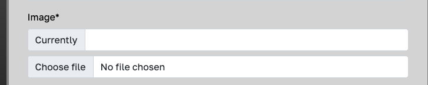

# **Sports Expert Testing**

## **Overview**
A wide range of testing was carried out during development including, Automated testing, manual testing, user story testing, code validation and bug testing.

[Back to README](/README.md)

## **Contents**

1. [Overview](#overview)
2. [Automated Testing](#automated-testing)
   - [Home App](#home-app)
   - [Blog App](#blog-app)
   - [Profiles App](#profiles-app)
3. [Manual Testing](#manual-testing) 
   - [Automated Testing Statements](#automated-testing-statements) 
   - [Epic Milestone Acceptance Criteria Testing](#epic-milestone-acceptance-criteria-testing) 
   - [User Story Testing](#user-story-testing)
   - [Javascript Testing](#javascript-testing)
4. [Validation](#validation)
   - [Python Code Validation](#python-code-validation)
   - [Javascript JShint Validation](#javascript-jshint-validation)
   - [CSS Jigsaw validation](#css-jigsaw-validation)
   - [HTML W3 validation](#html-w3-validation)
   - [Lighthouse Testing](#lighthouse-testing)
5. [Bugs](#bugs)   
   - [Solved Bugs](#solved-bugs)
   - [Unsolved Bugs](#unsolved-bugs)
6. [Responsiveness](#responsiveness)   
7. [Browser Testing](#browser-testing)

## **Automated testing**

99% Of the code was covered throughout the automated testing process.
I will manually test the remaining 1%

The missing statement in the unit tests is the Delete method in the DeleteProfile Class in the profiles app which deletes the user, redirects them to the home page and gives them a success message.
This method will be manually tested in the Manual Testing Section.

### **Home App**

The home app only had 1 unit test overall, for the Homeview view function.

### **Blog App**
The blog app was the first app I tested through unit testing so has by far the most tests out of all the apps as a lot of the same logic in this app is covered in tests here that are also in other app files.

#### **Blog Forms**

 - The blog forms file had 6 tests.
   

#### **Blog Models**

 - The blog models file had 7 tests.
   

#### **Blog Views**

 - The blog views file was by far the hardest portion of testing to cover and overall had 16 tests.
   

### **Profiles App**

#### **Profiles Models**

 - The profiles model file had 1 test.
   

 - The profile views file had 5 tests
    

[Top of page &uarr;](#contents)

## **Manual Testing**

### **Automated Testing Statements**

As specified in the automated testing section there was 1 missing statement that needed to be manually tested for full coverage. That was the delete method from the DeleteProfile Class in the profiles app.

To test this method there were a few steps that I took

1. Created a fake user on the site and logged in.
2. Navigated to the delete profile page from the profile section.
3. Ensured that the correct url was showing to match the user.
4. After pressing the delete button ensure that I was redirected back to the home page and was shown a success message stating "Profile was deleted successfully."
5. Tried to log back in as the user to ensure the user and profile no longer existed in the database.

All tests Passed

### **Epic Milestone  Acceptance Criteria Testing**

There were 3 milestones that did not have acceptance criteria. The user stories in these milestones will be tested in the user story section.

#### **EPIC: Django Installation and app setup [#Milestone 1](https://github.com/seanj06/P4-Sports-Expert/milestone/1?closed=1)**

**Acceptance criteria 1** : Django installed to gitpod workspace and new project created

  - Django was installed at the beginning of the project development

**Acceptance criteria 2** : Install postresql database

  - Postgres sql database was also installed at the start of the project development from the terminal.

**Acceptance criteria 3**: Create new app inside project

 - The "home" app was the first app created at start of development as the base app for the homepage view

#### **EPIC: Home page creation [#Milestone 3](https://github.com/seanj06/P4-Sports-Expert/milestone/8)**

**Acceptance criteria 1**: Users are brought to homepage when first entering the site

 - The blank url for the site leaves users at the index.html page(i.e the home page)

**Acceptance criteria 2** :Users can log in and out from the navbar

 - User are able to log in and out from the navbar at the top of the page. The navbar options will change depending on if the user is logged in or out.

**Acceptance criteria 3**: What users see on the home page differs depending on if they are logged in or out 

 - The navbar and carousel options will change depending on if the user is logged in or out. If the user is logged out they will have access to the log in, sign up, and blog page. If they are logged in they will have access to the log out, blog page, add a blog page and profile page.

#### **EPIC: User profile [#Milestone 4](https://github.com/seanj06/P4-Sports-Expert/milestone/10)**

**Acceptance criteria 1**: Users are able to go to profile section from home page

 - Provided the user is logged in, they are able to navigate to their profile page from both the navbar and carousel on the home page.

**Acceptance criteria 2**: Users can upload own image for their profile aswell as add a quick bio 

 - Users are able to add their own profile picture aswell as enter their full name and add some info about themselves from the edit profile page.

**Acceptance criteria 3**: Users can see all of their blog posts from profile section 

 - Users are able to see all of their blogposts from the myblogs page in the profile section. If the user has no blogs they will be shown a button that will direct them to the add a blog page.

#### **EPIC: Blog view page creation [#Milestone 6](https://github.com/seanj06/P4-Sports-Expert/milestone/9)**

**Acceptance criteria 1** : Users can access blog page via a button on home page

 - Regardless of whether users are signed in or not, they are able to access the blog home page via both the navbar and carousel on the home page.

**Acceptance criteria 2**: Users can view blogs by categories or by date

 - This criteria was not met due to time constraints and will be talked about further in user stories testing.

**Acceptance criteria 3**: Users can access pages to edit or delete their posts if they are logged in 

 - Providing a user is logged in, they will be shown buttons on the bottom of their blogpost card to either edit or delete the post.

#### **EPIC: U/X [#Milestone 7](https://github.com/seanj06/P4-Sports-Expert/milestone/4)**

**Acceptance criteria 1**: Home page follows U/X design, has navigation links aswell as a small about section.

 - The home page follows the same design to match the rest of the site, like the rest of the site includes a navbar at the top of the page and has an about section below the carousel.

**Acceptance criteria 2**: Blog page follows same design/colour pattern as home page. Blog posts are paginated by 6 posts.
Blog post cards show a title, category, date created, image and a description snippet. 

 - The blog page has the same design as the rest of the site. Blog posts are paginated by 6 posts and features 4 buttons for users to navigate to the next page, previous page, first page and last page.
 The blogpost cards include either a placeholder image depending on category if the user has not uploaded an image, or the user uploaded image, the title, description, date posted and category.

**Acceptance criteria 3**: Add a blog page and edit blog page have similar design to other pages. Success urls should take user back to blog detail page. 

 - The add a blog page and edit blog page follow similar form design to the rest of the forms on the site. After valid form submission the add a blog page will take the user to the blog home page and the edit blog will take the user back to the blog detail page they have just edited.

**Acceptance criteria 4**: Sign up, Log in and Log out pages follow similar design to other pages, success messages do not push down page content. 

 - The sign up and log in pages follow the same crispy-form design as other forms on the site. The log out page has the same design as other single button pages on the site. The success messages has a z-index of 1 so it is placed on top of the other content rather than push it down.

**Acceptance criteria 5**: Profile page follows similar design pattern to other pages. Profile page should show user information aswell as a button to user blogs, date profile created, a button to edit profile, info on when profile last edited. 

 - The profile page has a similar colour scheme and design pattern to the rest of the site. The profile page shows the username, full name if user has entered one, user profile picture if they have uploaded one, date the user joined, date the profile was last edited, a button to edit profile and a button to navigate to myblogs page.

**Acceptance criteria 6**: Active page to be added to navbar.

 - The navbar has an active page feature by a blue underline underneath the active page.

**Acceptance criteria 7**: Footer to be added to base.html with social link icons and name of author and year of creation

 - The footer features 4 social media link icons for Facebook, Twitter, Instagram and Github. It also features a message about site author and year of development.

 [Top of page &uarr;](#contents)

### **User Story Testing**

Overall there were 33 completed user stories and 4 uncompleted user stories throughout the projects development they will all be tested below to ensure criteria has been met for each story.

#### 1.[USER STORY: First Heroku Deployment #1](https://github.com/seanj06/P4-Sports-Expert/issues/1)

 - As a developer I can deploy my project on Heroku so that it can be seen and used by other users

   - The project was successfully deployed on Heroku and is currently able to be seen and used by all users.

#### 2.[USER STORY:Create new django project and app #2](https://github.com/seanj06/P4-Sports-Expert/issues/2)

 - As a developer I can create a new Django project correctly so that my project can be built in the correct way

   - A new django project was created at the beginning of development.

#### 3.[USER STORY:Django package installation #3](https://github.com/seanj06/P4-Sports-Expert/issues/3)

 - As a developer I can install the needed librarys and packages so that my project is set up correctly

   - All relevant django packages including the postgres database and cloudinary storage were installed at the beginning of development.

#### 4.[USER STORY: Add Models #4](https://github.com/seanj06/P4-Sports-Expert/issues/4)

 - As a developer I can add database models so that the database knows how to handle user data

   - Multiple database models were added throughout development including BlogPost model, Comments Model and Profile Model.

#### 5.[USER STORY:Create Templates #5](https://github.com/seanj06/P4-Sports-Expert/issues/5)

 - As a developer I can create templates so that users can see the website online

   - Multiple templates were added throughout the development of the project to render all pages of the site.

#### 6.[USER STORY:Create an account #6](https://github.com/seanj06/P4-Sports-Expert/issues/6)

 - As a User I can create an account so that I can create a blog post

   - When users enter the site they can sign up for an account through either the navbar link or the carousel link which both brings the user to the sign up page. Once they have made an account they will be able to navigate to the add a blog page where they can add their own blogpost.

#### 7.[USER STORY: Create Multiple Apps #8](https://github.com/seanj06/P4-Sports-Expert/issues/8)

 - As a developer I can create multiple apps for my project so that my code is kept well organised

   - Multiple apps were created during project development including the home app, the blog app and the profiles app.

#### 8.[USER STORY: Create Views #9](https://github.com/seanj06/P4-Sports-Expert/issues/9)

 - As a developer I can create views so that the function in the views can render and handle my templates appropriately for users to see

   - Views were created for all apps to handle the logic of the project.

#### 9.[USER STORY:Create Superuser #10](https://github.com/seanj06/P4-Sports-Expert/issues/10)

 - As a developer I can create a superuser so that I can manage my application from the admin panel

   - The superuser was created from the terminal at the start of development.

#### 10.[USER STORY:Site Navigation #11](https://github.com/seanj06/P4-Sports-Expert/issues/11)

 - As a User I can navigate the site easily so that I can easily find what I am looking for

   - The nav bar is visible on all site pages at the top of the screen for users to navigate the site easily. The hero logo also brings the user back to the home page if clicked. The carousel on the home page also gives users multiple navigation options.

#### 11.[USER STORY:Cloudinary #12](https://github.com/seanj06/P4-Sports-Expert/issues/12)

 - As a developer I can install cloudinary so that all my images can still be displayed on my site after being deployed

   - Cloudinary was installed in development prior to being deployed to heroku and tested to make sure all user uploaded images were showing correctly.

#### 12.[USER STORY:Install allauth #13](https://github.com/seanj06/P4-Sports-Expert/issues/13)

 - As a developer I can install allauth so that site users can create an account to log in

   - Allauth was installed at the start of development

#### 13.[USER STORY:Home page #14](https://github.com/seanj06/P4-Sports-Expert/issues/14)

 - As a user I can visit the homepage so that I can log into my account and navigate to different parts of the site

   - The homepage is the first page users are brought to when entering the site, from there they can navigate to multiple pages from either the navbar or the carousel.

#### 14.[USER STORY: Home Page styling #15](https://github.com/seanj06/P4-Sports-Expert/issues/15)

 - As a developer I can style the home page so that it is visually appealing for new and frequent users

   - The home page was style to catch new and returning users attention as soon as they enter the site.

#### 15.[USER STORY: Django Forms #17](https://github.com/seanj06/P4-Sports-Expert/issues/17)

 - As a developer I can create django forms so that user database input can be validated and handled correctly

   - Django forms were used on all apps for user forms and styled and handled using crispy-forms and bootstrap.

#### 16.[USER STORY:Add image to blog post #19](https://github.com/seanj06/P4-Sports-Expert/issues/19)

 - As a user I can add an image to my blog post so that I can make my post stand out

   - Users are able to upload their own image to their blogposts. If they choose to not upload an image the placeholder image will change depending on category chosen.

#### 17.[USER STORY:Create a blog post #21](https://github.com/seanj06/P4-Sports-Expert/issues/21)

 - As a user I can create a blog post so that others can see my blog posts online

   - Users are able to make their own blogposts provided they have made an account and are signed in.

#### 18.[USER STORY:Read blog post #22](https://github.com/seanj06/P4-Sports-Expert/issues/22)

 - As a user I can view my blog post so that I can check I am happy with it

   - Users are able to view there blog posts from either the blog home page or the myblogs page via their profile.

#### 19.[USER STORY:Update blog post #23](https://github.com/seanj06/P4-Sports-Expert/issues/23)

 - As a user I can update my blog post so that I can change anything I am not happy with

   - Users are able to update their blog posts from either the blog home page or the myblogs page via their profile.

#### 20.[USER STORY:Delete Blog Post #24](https://github.com/seanj06/P4-Sports-Expert/issues/24)

 - As a user I can delete my blog post so that I can remove any posts I no longer want

   - Users are able to delete their blog posts from either the blog home page or the myblogs page via their profile.

#### 21.[USER STORY:Style account creation pages #25](https://github.com/seanj06/P4-Sports-Expert/issues/25)

 - As a developer I can style the log in, log out and sign up pages so that the UI matches the rest of the website pages

   - The log in, log out and sign up pages were all include the navbar and footer inherited from the base html file and the fonts and colours used match the rest of the site.

#### 22.[USER STORY:User Messages #26](https://github.com/seanj06/P4-Sports-Expert/issues/26)

 - As a developer I can add custom user messages so that the user knows the action they performed has been successfull or failed.

   - Custom success messages are added to all user actions to show the user the action was successfull.

#### 23.[USER STORY:Create a profile #27](https://github.com/seanj06/P4-Sports-Expert/issues/27)

 - As a user I can create a profile so that I can keep track of my blogs

   - When a user signs up for an account a profile is automatically made for them using django signals. The user is then able to edit the profile from the profile page once logged in.

#### 24.[USER STORY:Upload profile image #28](https://github.com/seanj06/P4-Sports-Expert/issues/28)

 - As a user I can upload my own image to my profile so that I can customise my own profile

   - Users are able to upload their own profile image through the edit profile page.

#### 25.[USER STORY:View blog posts #29](https://github.com/seanj06/P4-Sports-Expert/issues/29)

 - As a user I can view my blog posts from my profile so that I can keep track of all my blogs on one page

   - Users are able to view all of their blogposts by clicking on the myblogs button on the profile page.

#### 26.[USER STORY:Delete/Edit blogs from profile page #30](https://github.com/seanj06/P4-Sports-Expert/issues/30)

 - As a user I can Delete or Edit my blog posts from my profile page so that I can manage my blogs from one page

   - Users are able to edit and delete their blogposts from via the profile page by clicking on the myblogs button and clicking on either the edit or delete button on the blogpost they wish to edit or delete.

#### 27.[USER STORY:Profile Form #31](https://github.com/seanj06/P4-Sports-Expert/issues/31)

 - As a user I can add my profile info by filling out a form so that I can save the info to my profile

   - Users are able to add information to their profile including their full name and about themselves from the edit profile page.

#### 28.[USER STORY:Blog Page #32](https://github.com/seanj06/P4-Sports-Expert/issues/32)

 - As a developer I can style the blog page so that the user gets a good u/x experience

   - The blog page is styled to match the rest of the site and includes fully responsive bootstrap cards.

#### 29.[USER STORY:Forms #33](https://github.com/seanj06/P4-Sports-Expert/issues/33)

 - As a developer I can style the user forms so that they match the design of the rest of the site

   - The user forms were styled and handled using crispy-forms and the colours and fonts were styled to match the rest of the site.

#### 30.[USER STORY:Profile page #34](https://github.com/seanj06/P4-Sports-Expert/issues/34)

 - As a developer I can style the user profile page so that all of the correct user information is displayed and the design matches the rest of the site

   - The profile page was styled so that the colours and fonts match the rest of the site. All information that the user enters on the edit profile page is displayed on the profile page.

#### 31.[USER STORY:Footer #35](https://github.com/seanj06/P4-Sports-Expert/issues/35)

 - As a developer I can add a footer to my website so that I can display social media links and creation information

   - The footer is a part of the base.html file so it is shown on every page on the site. The footer includes the developer name, year of development and 4 clickable social media icons.

#### 32.[USER STORY: Add comments to blogs #36](https://github.com/seanj06/P4-Sports-Expert/issues/36)

 - As a user I can comment on blogs so that I can interact with the site community

   - Provided the user has signed up for an account and are signed in they are able to comment on all blog posts.

#### 33.[USER STORY:Custom error pages #37](https://github.com/seanj06/P4-Sports-Expert/issues/37)

 - As a developer I can create custom error pages so that they match the theme of the site

   - The 404,403 and 500 error pages were all given custom styling to match the rest of the site.

**The following 4 user stories were not completed due to time constraints but were all included in the future features section of the readme.**

#### [USER STORY:Reset Password #7](https://github.com/seanj06/P4-Sports-Expert/issues/7)

 - As a user I can reset my password so that i can retrieve my account if i forget my password

#### [USER STORY:Search bar #16](https://github.com/seanj06/P4-Sports-Expert/issues/16)

 - As a developer I can implement a search bar into the home page so that users can search for posts by topic

#### [USER STORY:Filter blog posts by category #18](https://github.com/seanj06/P4-Sports-Expert/issues/18)

 - As a user I can filter blog posts so that I can easily find the blogs I am looking for

#### [USER STORY: Search for blog posts by user #20](https://github.com/seanj06/P4-Sports-Expert/issues/20)

 - As a user I can search for user specific blog posts so that I can follow my favourite bloggers

 [Top of page &uarr;](#contents)

### Javascript Testing

 - There is only one javascript function present in the development code so I manually tested the function rather than automated testing.

 - The function is the timeout function to control how long success messages stay on screen before they disappear
 

 - This function was manually tested by first commenting out the function altogether and making sure the message stayed on screen without it. The result was as expected.

 - The function was then tested by changing the milliseconds time to 8000 and a timer was used to time the seconds the message stayed on screen, then finally the milliseconds were changed back to the original 3000 and a timer was also used to time the message on screen. Result was as expected and all manual tests passed.

 [Top of page &uarr;](#contents)

## **Validation**

### **Python Code Validation**

The [CI Python Linter](https://pep8ci.herokuapp.com/) was used to validate Python code used throughout the project. 

#### **SportsBlog folder**

asgi.py No errors

urls.py No errors

wsgi.py No errors

settings.py Returned 4 errors. All to do with password validators being too long. Since this is code that is pre built django code I did not want to try re structure them.

#### **Blog App**

admin.py No errors

apps.py No errors

forms.py No errors

models.py No errors

urls.py No errors

views.py No errors

test-forms.py No errors

test-models.py No errors

test-views.py No errors

#### **Profiles app**

admin.py No errors

apps.py No errors

forms.py No errors

models.py No errors

signals.py No errors

urls.py No errors

views.py No errors

test_models.py No errors

test_views.py No errors

#### **Home App**

apps.py No errors

urls.py No errors

views.py No errors

test_views.py No errors

[Top of page &uarr;](#contents)

### **Javascript JShint Validation**

There was only 1 Javascript function in the code to run through the jshint validator. It returned 1 error "1 undefined variable bootstrap"
I tried a few different solutions to fix this error but couldnt find any that worked and concluded this was because of the built in bootstrap code that the function calls.

### **CSS Jigsaw validation**

There was only 1 CSS static file in the code to be run through the jigsaw validator. It returned no errors

### **HTML W3 validation**

Because of the django templating language html files could not be testing file by file through the W3 validator, rather they had to be tested by page source code. I tested the html by right clicking on the page, navigating to view page source and manually entering the html into the validator.
Through all of the page testing only 1 error was found which is related to the django templating language.

Page source by site address. No errors

Home Page. No errors

Sign Up Page. No errors

Sign Out Page. No errors

Profile Page. No errors

Login Page. No errors

Edit Profile Page. No errors

Login Blog Page. No errors

Blog Home Page. No errors

Add a blog Page. No errors

Login Page. 1 error

The error showing "No p element in scope but a p end tag seen." is generated html from the django templating language so cannot be fixed.

[Top of page &uarr;](#contents)

### **Lighthouse Testing**

Lighthouse testing was done done through the chrome devtools by right clicking on the site page, navigation to inspect, then navigating to lighthouse report.
I gathered reports for both desktop and mobile devices.

#### **Home page**

Home Page Desktop

Home Page Mobile

#### **Blog Home Page**

Blog Home Page Desktop

Blog Home Page Mobile

#### **Blog Detail page**

Blog Detail Page Desktop

Blog Detail Page Mobile

#### **Add A Blog Page**

Add A Blog Page Desktop

Add A Blog Page Mobile

#### **Edit Blog Page**

Edit Blog Page Desktop

Edit Blog Page Mobile

#### **Delete Blog Page**

Delete Blog Page Desktop

Delete Blog Page Mobile

#### **Profile Page**

Profile Page Desktop

Profile Page Mobile

#### **Edit Profile Page**

Edit Profile Page Desktop

Edit Profile Page Mobile

#### **Delete Profile Page**

Delete Profile Page Desktop

Delete Profile Page Mobile

#### **My Blogs Page**

My Blogs Page Desktop

My Blogs Page Mobile

#### **My Blogs Page(With no blogs)**

No Blogs Page Desktop

No Blogs Page Mobile

#### **Sign In Page**

Sign in Page Desktop

Sign in Page Mobile

#### **Sign Out Page**

Sign Out Page Desktop

Sign Out Page Mobile

#### **Sign Up Page**

Sign Up Page Desktop

Sign Up Page Mobile

#### **Errors and low score reasons**

On most of the pages tested the best practices score is 92 out of 100. The reason for this is "Cookie" errors related to cloudinary in the issues panel as seen in the image below.

 - 

On all of the pages that include forms with user cloudinary uploads the accessibility is 97 out of 100. This is because of an unreachable a link tag that is missing a label for screen readers.
 - 
 - 

On most pages performance score is down a few percent. On inspection this is again because of errors in the issues panel stating "eliminate render blocking resources". It seems to be bootstrap causing this issue.

 - 

 [Top of page &uarr;](#contents)

## **Bugs**

### **Solved Bugs**

| **Bug** | **Bug Description** | **Fix** |
|---------|---------------------|---------|
| Card sizes | Blog cards differing in sizes due to text length of user inputs | To fix this I Added flex fill to the card parent class which stretches all cards to the size of the biggest card. |
| User Upload images | User upload images were not updating after form submission and staying as the placeholders | I fixed this by adding enctype of multipart/form data to the user form.
| Blog images on smaller width screens | On smaller width screens images on the blog cards were distorting due to the height styles given by the bootstrap card class | I fixed this by adding a media query for a fixed height on the blog images on medium to small screens.
| Comment text overflowing | On smaller screens if the user typed one big word their comment would overflow out of the container. | To fix this I added a text-wrap css style to make sure the text overflowed onto the next line.
| Users able to delete other users items | Late into development I spotted a bug which was that users could delete other users items such as blogposts, comments and profiles by changing the url i.d. | To fix this bug I added a UserPassesTest Mixin to every edit and delete view and ensured users were shown a 403 page if they tried to access other users items.
| User upload image changing shape | Late into development I also noticed that if a user uploaded an obscure size image to their profile it changed the shape of the circular parent container. | To fix this bug I changed the dimensions of the parent container and gave max width and height to the profile upload image.

### **Unsolved Bugs**

#### **Edit Form Current Image File**

On all edit forms that include a user image upload, there is a bug that doesnt show the user the current image they have uploaded even if they have previously done so.

After a lot of research I have concluded that this is a bug in the version of crispy-forms I am using(crispy-bootstrap5).

#### **Edit Profile Whitespace**

Late into development I noticed a bug where users could Enter whitespace into the edit profile form and the form would accept it as valid.

The reason for this is because I have set up django signals for a user profile to be created everytime a user signs up for an account. However since I only set this up after the superuser and other users were already created I needed to put Blank and Null = True in some fields in the model which is causing the form to accept whitespace. 

Since nearly every model in my database is connected in some way I have concluded the only way to fix this bug would be to wipe all databases clear of all data which is not really feasible at this point in development.

[Top of page &uarr;](#contents)

## **Responsiveness**

I tested 10 devices at random on chrome devtools for responsiveness ranging from large to small screens. Things I was looking out for while testing includes, font sizes, font overflow, ratios, image sizes, image overflow and container overflow.

| **Device** | **Result Pass/Fail** |
|------------|----------------------|
| Galaxy Note 2 | Pass |
| Nexus 5 | Pass |
| Iphone 4 | Pass |
| Iphone XR | Pass |
| Nexus 7 | Pass |
| Pixel 2 XL | Pass |
| Kindle Fire HDX | Pass |
| Ipad Mini | Pass |
| Ipad Pro | Pass |
| Nest Hub Max | Pass |

## **Browser Testing**

The site was tested using 4 different browsers. Things looked out for when testing on different browsers included: All styles loading correctly, all pages loading correctly, all images showing correctly, all forms validating correctly and all navigation working correctly.

| **Browser** | **Result Pass/Fail** |
|-------------|----------------------|
| **Chrome** | **Pass** |
| **Safari** | **Pass** |
| **Firefox** | **Pass** |
| **Microsoft Edge** | **Pass** |

[Top of page &uarr;](#contents)

[Back to README](/README.md)

